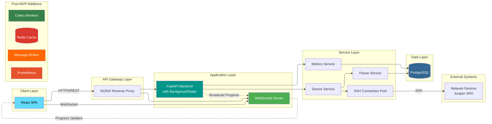

# Technical Design Document: Longevity Dashboard Modernization

**Document Version:** 2.0  
**Date:** March 14, 2026  
**Status:** Proposed Architecture  
**Timeline:** 2 Weeks (Enterprise MVP)

---

## Executive Summary

This document outlines the technical architecture for building a greenfield replacement for the legacy Longevity Dashboard. Per management's directive, this system is being built entirely from scratch to ensure enterprise scalability. The existing monolithic Flask application and Excel-based storage will be retired, and the legacy code will be used strictly as a reference blueprint for business logic. This new architecture addresses critical limitations including tight coupling, lack of horizontal scalability, and synchronous bottlenecks.

The selected technology stack is specifically designed to maximize developer velocity, allowing a single engineer to deliver a robust, enterprise-ready MVP within a 2-week sprint.

---

## 1. Current System Analysis

### 1.1 Existing Architecture (Reference Blueprint Only)

The current legacy system consists of:
- **Backend:** Flask application (app.py) serving both API and HTML templates
- **Business Logic:** Monolithic Longevity.py (~1275 lines) handling SSH connections, command execution, parsing, and data persistence
- **Frontend:** Server-rendered HTML with vanilla JavaScript
- **Data Storage:** Excel file (security_monitoring.xlsx) with file-based locking
- **Configuration:** JSON file (data.json) with hardcoded credentials

### 1.2 Critical Limitations of Legacy System

| Issue | Impact | Severity |
|-------|--------|----------|
| Monolithic architecture | Cannot scale horizontally | High |
| Excel-based storage | Concurrent access bottlenecks, no ACID guarantees | High |
| Synchronous SSH operations | Blocks request threads, poor user experience | High |
| Hardcoded credentials | Security vulnerability | Critical |
| No API versioning | Breaking changes affect all clients | Medium |
| Tight coupling | Difficult to test, maintain, or extend | High |
| No observability | Cannot diagnose production issues | Medium |

---

## 2. Proposed Architecture

### 2.1 System Architecture Diagram (MVP)



### 2.2 Technology Stack Comparison

| Component | Legacy | Proposed (MVP) | Justification for Solo Execution |
|-----------|--------|----------------|----------------------------------|
| **Backend Framework** | Flask | FastAPI | Async support, automatic OpenAPI docs, and type safety drastically reduce debugging time for a solo dev |
| **Frontend** | Vanilla JS | React | Component reusability and vast ecosystem allow rapid UI development |
| **Database** | Excel files | PostgreSQL | ACID compliance, concurrent access, scalability |
| **Real-time Updates** | None | WebSocket | Live progress updates, reduced server load vs legacy polling |
| **Task Queue** | None | BackgroundTasks | Built-in async execution removes the need to manage external message brokers |
| **Containerization** | None | Docker Compose | Local orchestration guarantees it works on the server exactly as it does locally |

---

## 3. Detailed Component Design

### 3.1 Backend API (FastAPI)

**Why FastAPI over Flask:**
- Native async/await support for concurrent SSH operations
- Automatic request/response validation using Pydantic
- Built-in OpenAPI documentation generation
- Type hints enable better IDE support and fewer runtime errors

**API Structure:**
```
/api/v1
├── /devices
│   ├── GET    /              # List all devices
│   ├── GET    /{id}          # Get device details
│   ├── POST   /              # Register new device
│   └── DELETE /{id}          # Remove device
├── /metrics
│   ├── GET    /              # Query metrics (with filters)
│   ├── GET    /latest        # Latest metrics per device
│   └── GET    /export        # Export to CSV/JSON
├── /jobs
│   ├── POST   /collect       # Trigger metric collection
│   └── GET    /{job_id}      # Job status summary
└── /health
    └── GET    /live          # Liveness probe
```

### 3.2 Frontend (React)

**Why React over Server-Side Rendering:**
- Component-based architecture enables code reuse
- Virtual DOM provides efficient updates for real-time data
- Native WebSocket support with custom hooks for live UI updates

**Key Features:**
- Real-time metric updates via WebSocket
- Live progress notifications during collection ("Device 3/10: Connecting...")
- Responsive data tables with sorting, filtering, pagination
- Export functionality (CSV, JSON, PDF)

### 3.3 Database Schema (PostgreSQL)

**Why PostgreSQL over Excel:**
- **Concurrency:** MVCC allows multiple readers/writers without locking
- **Reliability:** ACID transactions, WAL for crash recovery
- **Scalability:** Partitioning, replication, sharding capabilities

**Core Tables:**

```sql
-- Devices table
CREATE TABLE devices (
    id UUID PRIMARY KEY DEFAULT gen_random_uuid(),
    name VARCHAR(255) NOT NULL UNIQUE,
    hostname VARCHAR(255) NOT NULL,
    device_type VARCHAR(50) NOT NULL,
    status VARCHAR(50) DEFAULT 'active',
    created_at TIMESTAMP DEFAULT NOW(),
    updated_at TIMESTAMP DEFAULT NOW()
);

-- Metrics table (partitioned by timestamp)
CREATE TABLE metrics (
    id BIGSERIAL,
    device_id UUID REFERENCES devices(id),
    timestamp TIMESTAMP NOT NULL,
    model VARCHAR(255),
    junos_version VARCHAR(100),
    routing_engine VARCHAR(255),
    cpu_usage INTEGER,
    memory_usage INTEGER,
    flow_session_current BIGINT,
    cp_session_current BIGINT,
    has_core_dumps BOOLEAN,
    global_data_shm_percent INTEGER,
    raw_data JSONB,
    PRIMARY KEY (id, timestamp)
) PARTITION BY RANGE (timestamp);

-- Jobs table
CREATE TABLE collection_jobs (
    id UUID PRIMARY KEY DEFAULT gen_random_uuid(),
    job_type VARCHAR(50) NOT NULL,
    status VARCHAR(50) NOT NULL,
    started_at TIMESTAMP,
    completed_at TIMESTAMP,
    created_by VARCHAR(255)
);
```

### 3.4 Service Layer Design (Built from Scratch)

Instead of migrating the monolithic Longevity.py, a new modular service layer will be built from scratch. The legacy code will be used strictly as a reference blueprint to understand the required business logic and regex patterns:

#### 3.4.1 Device Service
**Responsibilities:** Device registration, lifecycle management, and device type classification.

**Reference Implementation:** Device configuration logic previously hardcoded in data.json.

#### 3.4.2 Fast SSH Connection Service (Sub-1-Minute Optimization)
**Responsibilities:** High-speed connection management to reduce overall collection time.

**Sub-1-Minute Strategy:**
1. **True Concurrency (asyncio):** Utilize non-blocking I/O (asyncssh or equivalent) to poll all 10 devices simultaneously, rather than sequentially. Total collection time becomes equal to the slowest single device rather than the sum of all devices.
2. **Persistent Connection Pooling:** Maintain keep-alive authenticated tunnels to avoid the expensive TCP/SSH handshake overhead on every refresh.

**Reference Implementation:** Replaces the blocking get_handle() and login_and_run_commands() legacy functions.

#### 3.4.3 Command Execution Service
**Responsibilities:** Device-type-specific command execution and output buffering.

**Reference Implementation:** run_commands_vsrx() and run_commands_highend().

#### 3.4.4 Parser Service
**Responsibilities:** Output parsing with regex, data validation, and error detection.

**Reference Implementation:** parse_security_monitoring() and parse_system_core_dumps() (Legacy regex strings will be extracted, but the parsing engine will be completely rewritten).

#### 3.4.5 Metrics Service
**Responsibilities:** Metric aggregation and historical data queries.

**Reference Implementation:** Replaces the legacy save_to_excel() with robust SQLAlchemy ORM operations.

### 3.5 Asynchronous Task Processing with WebSocket Updates

**MVP Approach (2 Weeks):**
- Use FastAPI's built-in `BackgroundTasks` for async operations
- WebSocket connections for real-time progress updates
- No additional message broker infrastructure required for V1

**WebSocket Implementation (FastAPI):**
```python
@app.websocket("/ws/{job_id}")
async def websocket_endpoint(websocket: WebSocket, job_id: str):
    await websocket.accept()
    # Stream progress updates to connected clients
    async for progress in job_progress_stream(job_id):
        await websocket.send_json(progress)
```

**Task Flow:**
1. User clicks "Refresh Metrics" → API returns job_id
2. Frontend establishes WebSocket connection to /ws/{job_id}
3. BackgroundTask executes SSH commands asynchronously in parallel across all devices
4. Progress updates broadcast via WebSocket (e.g., "Device 1/10: Collecting metrics...")
5. Results stored in PostgreSQL
6. Frontend displays updated metrics in real-time

---

## 4. Scalability & Deployment

### 4.1 Horizontal Scaling Strategy

| Component | Scaling Method | Trigger |
|-----------|----------------|---------|
| FastAPI | Kubernetes HPA | CPU > 70% or Request Rate > 1000/s |
| PostgreSQL | Read replicas | Read latency > 50ms |

### 4.2 Containerization (Docker)

**Benefits:** Consistent environments (dev/staging/prod), simplified dependency management, resource isolation, and easy rollback capabilities.

**Container Structure:**
```
longevity-dashboard/
├── docker-compose.yml
├── backend/
│   ├── Dockerfile
│   └── requirements.txt
├── frontend/
│   ├── Dockerfile
│   └── package.json
└── nginx/
    └── nginx.conf
```

---

## 5. Security Enhancements

| Current Risk | Mitigation Strategy |
|--------------|---------------------|
| Hardcoded credentials in data.json | Environment variables / HashiCorp Vault |
| No authentication | JWT-based authentication with role-based access control |
| Plain HTTP | TLS/HTTPS everywhere, certificate management |
| No audit logging | Comprehensive audit trail in database |

---

## 6. Migration Strategy (Solo 2-Week Enterprise MVP Timeline)

### MVP Scope

To achieve a 2-week delivery as a solo developer while ensuring enterprise scale, the execution focuses on rapid scaffolding tools and native library features:
- FastAPI backend with async SSH operations
- PostgreSQL for data persistence
- React frontend with real-time WebSocket updates
- Docker containerization

### Week 1: Core Greenfield Development (Days 1-5)

**Day 1:** PostgreSQL Docker setup, schema creation, and FastAPI ORM initialization.

**Day 2-3:** Build the SSH Connection Service (optimized for async concurrency) and Parser Service from scratch using legacy regex as a blueprint.

**Day 4:** API Endpoints & WebSocket infrastructure (/ws/{job_id}).

**Day 5:** Unit testing critical paths and legacy data seed scripts.

### Week 2: Real-time UI & Deployment (Days 6-10)

**Day 6-7:** Scaffold React App, integrate WebSockets for live progress tracking.

**Day 8:** Build Data Tables, filtering, and export features.

**Day 9:** Write Dockerfiles and orchestrate with docker-compose.

**Day 10:** End-to-end testing, performance validation, and Management Demo.

---

## 7. Success Metrics

| Metric | Current Legacy | MVP Target | Measurement |
|--------|----------------|------------|-------------|
| Concurrent device monitoring | ~5 | 20+ | Load test results |
| API response time (p95) | N/A | <500ms | System metrics |
| Data collection time (10 devices) | ~5 minutes | < 1 minute | Job completion logs |
| System uptime | Unknown | 99% | Uptime monitoring |

---

## 8. Conclusion

The proposed architecture transforms the Longevity Dashboard from a monolithic application into a modern, scalable system capable of enterprise operations. The lightweight, modern nature of FastAPI and React enables a single developer to successfully execute this 2-week MVP without compromising on scalability or enterprise standards.

By using the legacy codebase strictly as a reference blueprint rather than attempting to refactor it, this approach guarantees a clean, scalable architecture from day one that fully resolves current Excel-locking and synchronous bottlenecks.

---

**Document Prepared By:** Shivang Singh (Lead Developer)  
**Review Status:** Pending Management Approval


---

## 9. Implementation Status

### ✅ Completed Components

**Infrastructure:**
- Docker Compose orchestration with PostgreSQL, Backend, and Frontend services
- Database schema with partitioned metrics table
- Environment-based configuration management

**Backend (FastAPI):**
- Core application structure with async support
- RESTful API endpoints for devices, metrics, and jobs
- WebSocket server for real-time progress updates
- Service layer with modular design:
  - DeviceService: Device lifecycle management
  - SSHService: Async SSH with connection pooling
  - ParserService: Command output parsing (extracted from legacy regex)
  - CommandService: Device-type specific command generation
  - CollectionService: Concurrent metric collection orchestration
  - MetricsService: Historical data queries

**Database Models:**
- Device model with type classification
- Metric model with JSONB for raw data storage
- CollectionJob model for async job tracking

**Frontend (React):**
- Minimal SPA with Vite build system
- MetricsTable component with responsive design
- WebSocket integration for live progress
- Device type filtering

### 🚀 Ready to Deploy

Run `./start.sh` to launch the complete system.

### 📋 Next Steps (Post-MVP)

1. Add authentication (JWT)
2. Implement export functionality (CSV, JSON, PDF)
3. Add Prometheus metrics
4. Set up CI/CD pipeline
5. Performance testing and optimization
